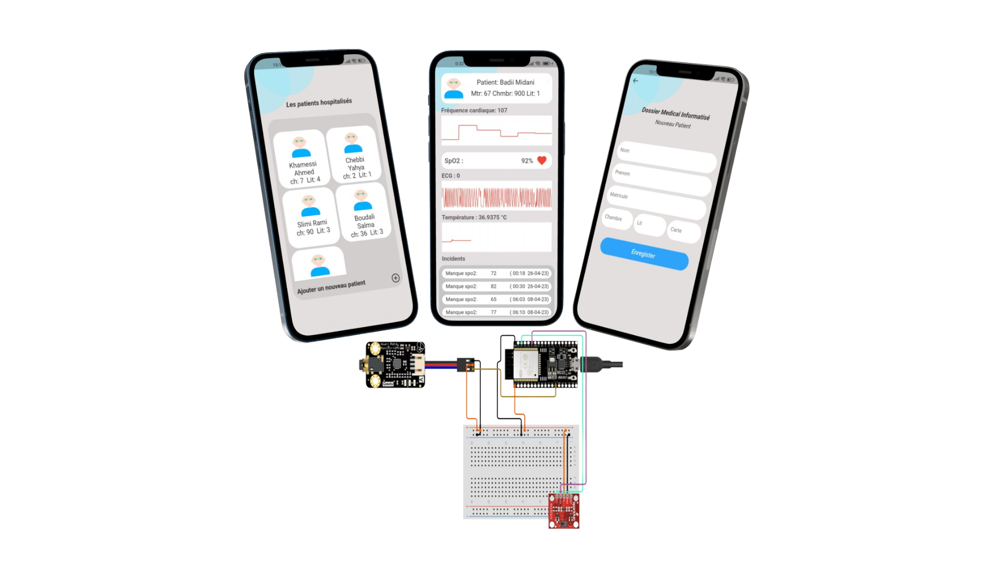
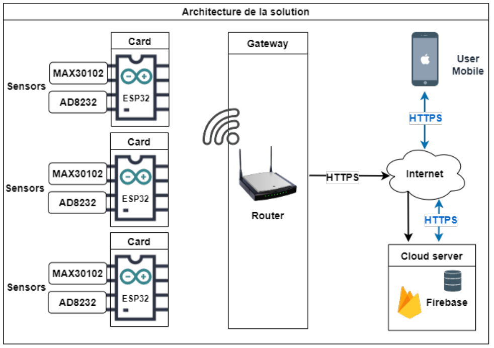
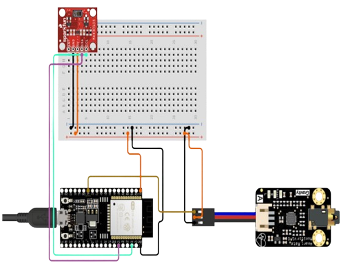
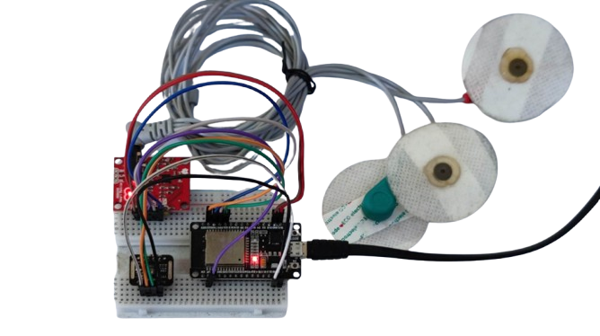
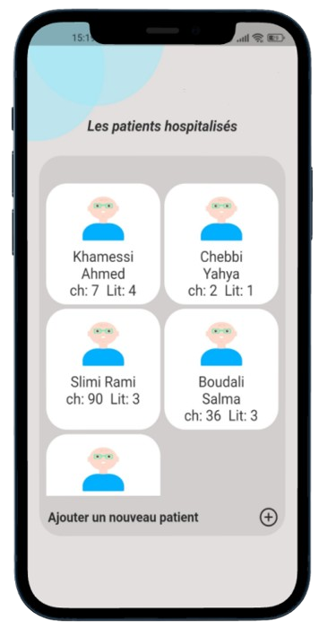
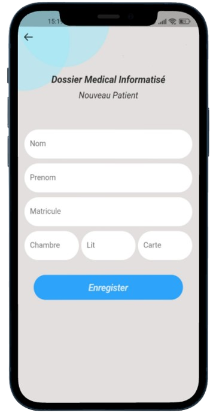
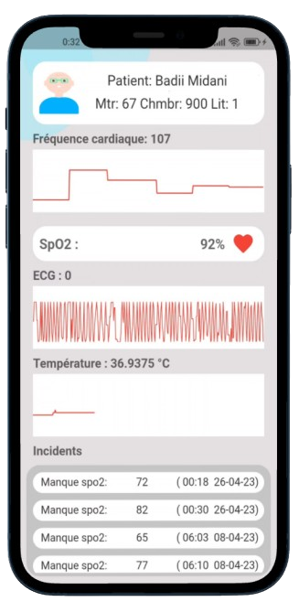

# Medical IoT System for Connected Patient Monitoring



## Description

This project involves the development of an IoT system that remotely monitors patient vitals using the **ESP32 board** and various sensors. The system tracks key metrics such as **heart rate**, **oxygen levels**, and **ECG** data, with real-time monitoring available on a **Flutter mobile application** for healthcare professionals. It aims to provide continuous and reliable monitoring for timely interventions in patient care.

## System Architecture

Below are diagrams illustrating the architecture of the Medical IoT System:

### Overall System Architecture



### ESP32 and Sensor Setup




These diagrams provide a clear view of how the system components interact, from the ESP32 gathering sensor data to the Flutter app displaying it in real time.

## Features

- **Real-Time Data Display**: Continuous streaming of heart rate, oxygen levels, and ECG readings on a Flutter app.
- **Wireless Monitoring**: Data is transmitted wirelessly using **ESP32**, ensuring flexibility in patient movement.
- **Alerts for Anomalies**: The system can log alerts in case of abnormal vital signs.
- **Mobile App Integration**: Healthcare professionals can view patient data remotely on their mobile devices.

## Screenshot





## Tech Stack

- **Flutter**: For building the cross-platform mobile application.
- **Firebase**: Used for real-time data storage and updates.
- **ESP32**: For collecting sensor data and transmitting it wirelessly.
- **C/FreeRTOS**: Used for programming the ESP32 for real-time data collection and transmission.
- **Sensors**: 
  - **MAX30102**: For heart rate and oxygen monitoring.
  - **AD8232**: For ECG monitoring.

## How to Run

### Hardware Setup:
1. Connect the **MAX30102** and **AD8232** sensors to the **ESP32** board.
2. Program the **ESP32** using **C/FreeRTOS** to collect and send sensor data.
3. Ensure the ESP32 is connected to a wireless network for data transmission.

### Mobile App Setup:
1. Clone the repository:
   ```bash
   git clone https://github.com/ChebbiYahya/Medical-IoT-System-for-Connected-Patient-Monitoring.git

2. Navigate to the project directory
    ```bash
    cd pizza-app

3. Install dependencies:
    ```bash
    flutter pub get

4. Run the app:
    ```bash
    flutter run